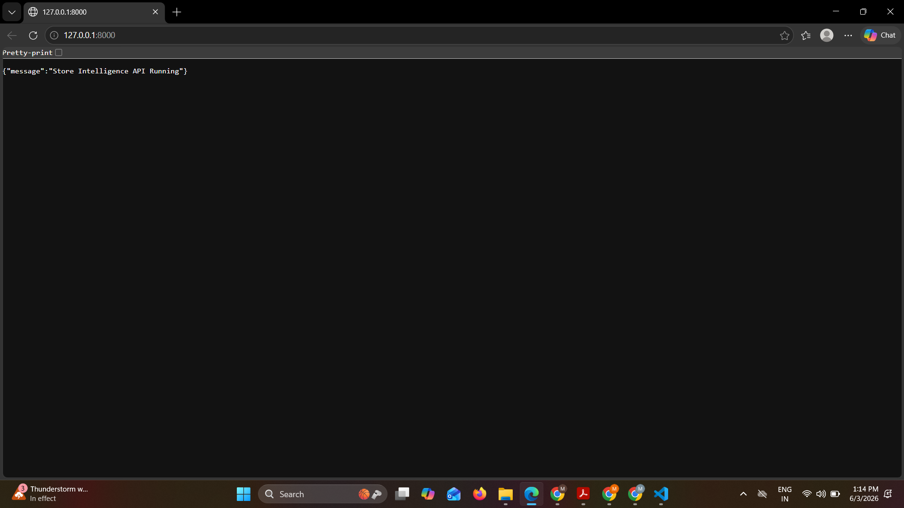
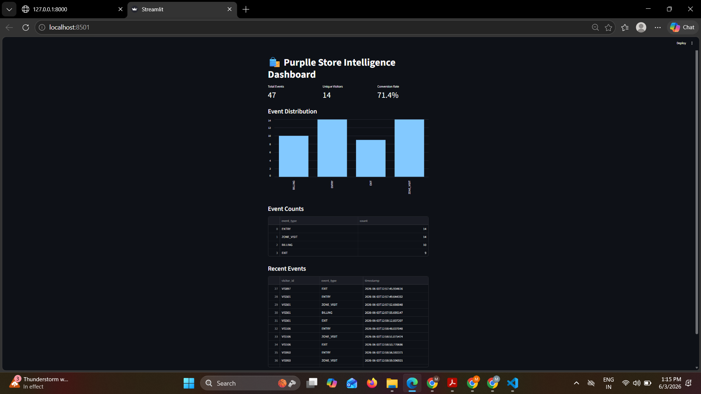
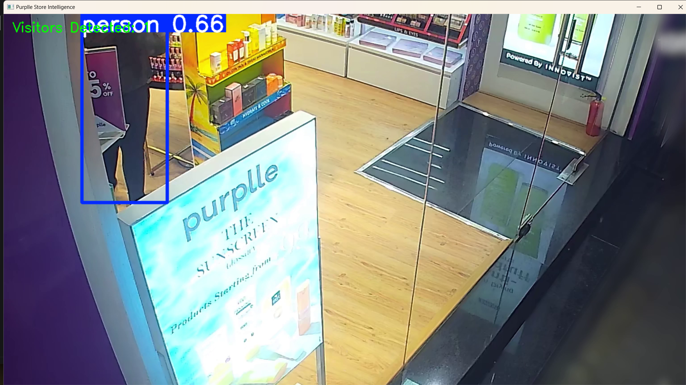
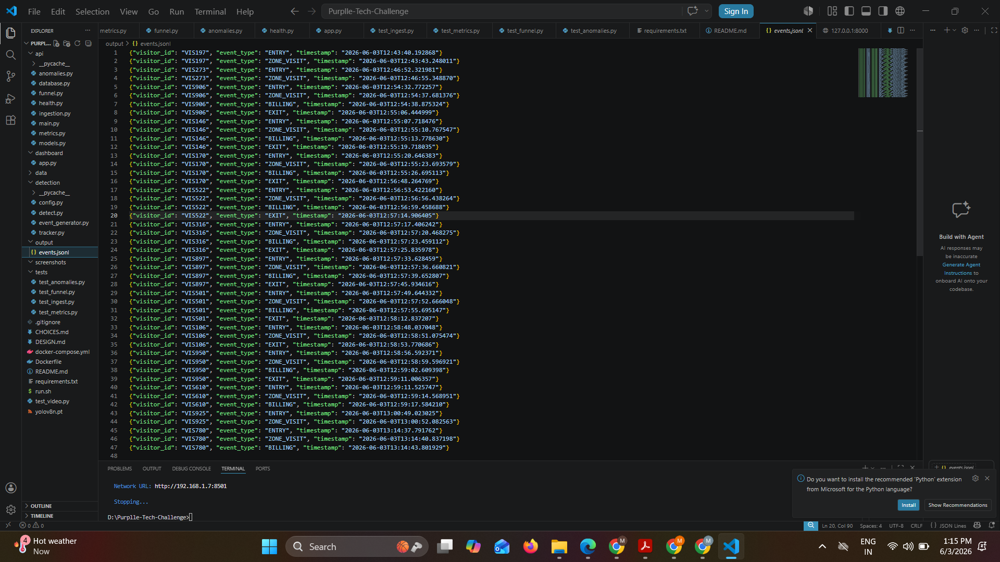

# Purplle Tech Challenge 2026 – AI Store Intelligence System

## Overview

The AI Store Intelligence System analyzes CCTV footage to generate real-time customer analytics and store intelligence insights.

The solution uses YOLOv8 for person detection, event generation, FastAPI for analytics services, and Streamlit for dashboard visualization.

---

## Features

### Person Detection

* Detects customers from CCTV footage using YOLOv8.
* Displays real-time bounding boxes.
* Tracks customer presence in the store.

### Event Generation

The system generates customer journey events:

* ENTRY
* ZONE_VISIT
* BILLING
* EXIT

All generated events are stored in:

```text
output/events.jsonl
```

### Analytics Dashboard

The dashboard provides:

* Total Visitors
* Zone Visits
* Billing Events
* Conversion Funnel
* Event Monitoring

### REST APIs

FastAPI exposes analytics endpoints for monitoring and reporting.

---

## Tech Stack

### AI & Computer Vision

* YOLOv8
* OpenCV

### Backend

* FastAPI
* Uvicorn

### Dashboard

* Streamlit

### Data Processing

* Python
* Pandas
* NumPy

### Testing

* Pytest

---

## Project Structure

```text
Purplle-Tech-Challenge/
│
├── data/
│
├── detection/
│   ├── detect.py
│   ├── tracker.py
│   ├── event_generator.py
│   └── config.py
│
├── api/
│   ├── main.py
│   ├── models.py
│   ├── database.py
│   ├── ingestion.py
│   ├── metrics.py
│   ├── funnel.py
│   ├── anomalies.py
│   └── health.py
│
├── dashboard/
│   └── app.py
│
├── tests/
│   ├── test_ingest.py
│   ├── test_metrics.py
│   ├── test_funnel.py
│   └── test_anomalies.py
│
├── output/
│   └── events.jsonl
│
├── screenshots/
│   ├── api_running.png
│   ├── dashboard.png
│   ├── detection.png
│   └── events_jsonl.png
│
├── requirements.txt
├── README.md
├── DESIGN.md
├── CHOICES.md
├── Dockerfile
├── docker-compose.yml
├── .gitignore
└── run.sh
```

---

## Installation

Install required packages:

```bash
pip install -r requirements.txt
```

---

## Running the Project

### Run Detection

```bash
python detection/detect.py
```

This will:

* Open CCTV footage
* Run YOLOv8 detection
* Display bounding boxes
* Generate visitor events

---

### Run FastAPI Server

```bash
python -m uvicorn api.main:app --reload
```

Open:

```text
http://127.0.0.1:8000
```

Expected response:

```json
{
  "message": "Store Intelligence API Running"
}
```

---

### Run Dashboard

```bash
python -m streamlit run dashboard/app.py
```

Open:

```text
http://localhost:8501
```

---

## Sample Event

```json
{
  "visitor_id": "VIS575",
  "event_type": "BILLING",
  "timestamp": "2026-06-03T12:35:20.286115"
}
```

---

## Screenshots

### API Running



### Dashboard



### YOLO Detection



### Generated Events



---

## Future Improvements

* Multi-camera tracking
* Customer re-identification
* Heatmap analytics
* Queue monitoring
* Real-time event streaming
* Cloud deployment

---

## Author

Submitted for the Purplle Tech Challenge 2026.
